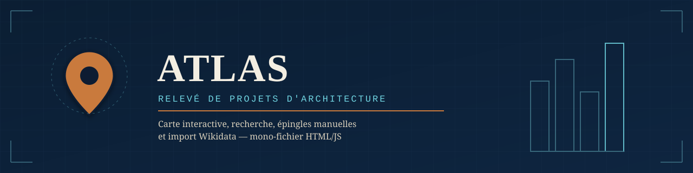

  

# Atlas — relevé de projets d'architecture

Carte interactive, façon Google Earth, pour localiser et cataloguer des projets d'architecture remarquables. Mono-fichier HTML/JS, sans installation, déployable tel quel sur GitHub Pages. Design noir/blanc/rouge minimaliste, suivant les principes Apple HIG.

## Fonctionnalités

- **Carte** — fond vectoriel OpenFreeMap (MapLibre GL), rendu net à tout niveau de zoom, regroupement des épingles selon le zoom
- **Épingles** — blanches par défaut, rouges une fois marquées « visité » (bascule rapide depuis la fiche du projet), déplaçables par glisser-déposer
- **Création rapide** — clic sur la carte (ou géocodage d'une adresse), 5 champs essentiels : nom, architecte, année, adresse, photo d'illustration
- **Fiche à onglets** — un seul clic sur une épingle ouvre directement la fiche complète (Infos / Photos / Plans / Commentaires), sans étape intermédiaire
- **Recherche automatique** — bouton « Compléter automatiquement » qui va chercher sur Wikidata l'architecte, l'année, la ville, la photo et le lien source manquants, sans écraser les champs déjà renseignés
- **Enrichissement libre** — photos multiples, plans/documents (libellé + lien), commentaires horodatés (journal cumulatif), notes, ville, lien source
- **Recherche** — par nom, architecte ou ville, navigable au clavier
- **Collections** — regrouper des projets dans des ensembles nommés, affichables/masquables indépendamment sur la carte ; un projet peut appartenir à plusieurs collections
- **Filtres** — par typologie, décennie de réalisation et statut visité/non visité, combinables entre eux et avec les collections
- **Import automatique depuis Wikidata** — par architecte, par lieu (rayon réglable), ou par année d'achèvement/ouverture ; lien de recherche rapide vers **Structurae** sur chaque fiche
- **Export / import JSON** — sauvegarde et restauration de toutes les données depuis le menu « ⋯ », pour ne rien perdre lors des mises à jour de l'app
- **Accessibilité** — focus clavier visible, cibles tactiles 44px, contraste AA, `aria-label` sur les contrôles, zones sûres iPhone, respect de `prefers-reduced-motion`
- **Fiabilité réseau** — délai maximal sur chaque appel externe (Wikidata, géocodage), avec état de chargement visible ; aucune recherche ne peut rester bloquée silencieusement
- **Base de référence** — couche grise de bâtiments d'architecte, activable depuis le menu Filtres ; un point s'ouvre en fiche préremplie et s'ajoute au relevé en un geste
- **Stockage local** — `localStorage`, aucun serveur, aucun compte requis

## Base de référence

Une base de bâtiments d'architecte (avec architecte, coordonnées et photo sur Wikidata) est reconstruite chaque semaine par GitHub Actions et publiée dans `data/reference.json`. L'app la charge au démarrage : recherche, import et complétion automatique fonctionnent alors instantanément, sans requête Wikidata en direct.

- Script : `data/build/build.mjs` (Node 20, sans dépendance)
- Workflow : `.github/workflows/build-reference.yml` — chaque lundi à 3 h UTC, ou à la demande
- Le fichier n'est recommitté que si les données ont changé
- Sans ce fichier (premier déploiement, ouverture en local), l'app fonctionne comme avant et interroge Wikidata en direct

**Premier lancement** : onglet *Actions* du dépôt → *Base de référence Wikidata* → *Run workflow*. Si l'étape de commit échoue avec une erreur de permission : *Settings → Actions → General → Workflow permissions → Read and write permissions*.

## Synchronisation entre appareils

Le relevé personnel (projets, collections) peut être synchronisé entre plusieurs appareils via un fichier JSON stocké dans un **dépôt GitHub privé**, distinct de ce dépôt public.

- Fusion projet par projet : la version la plus récente de chaque projet l'emporte ; deux appareils modifiant des projets différents ne s'écrasent pas
- Les suppressions sont mémorisées, pour qu'un autre appareil ne fasse pas réapparaître un projet supprimé
- Déclenchement : au démarrage, quelques secondes après chaque modification, au retour sur l'app, au retour du réseau, ou manuellement
- Hors connexion, tout reste enregistré sur l'appareil et part à la synchronisation suivante

**Mise en place (une fois)**
1. Créer un dépôt **privé** sur GitHub, par exemple `archibase-data`
2. Créer un jeton *fine-grained* (Settings → Developer settings → Personal access tokens → Fine-grained tokens) limité à ce dépôt, avec la permission *Contents : Read and write*
3. Sur chaque appareil : menu ⇅ → Synchronisation → saisir le dépôt et le jeton

Le jeton est conservé uniquement sur l'appareil ; ne pas le saisir sur un appareil partagé.

## Publication

Le relevé privé reste la version de travail. Depuis le panneau *Synchronisation* (menu ⇅), le bouton **Publier sur Archibase** fige son état et l'écrit dans `data/published.json` de ce dépôt public.

- Choix du contenu : tout le relevé, ou une seule collection
- Notes et commentaires exclus par défaut (case à cocher pour les inclure) ; collections et données internes jamais publiées
- Les visiteurs voient la sélection publiée à la place des exemples, en lecture seule ; recherche et filtres s'y appliquent
- Le propriétaire continue de voir et modifier son relevé complet, sans doublon
- Le jeton de synchronisation doit aussi avoir accès à ce dépôt public (*Contents : Read and write*)

## Déploiement

Ce dépôt contient un unique fichier `index.html` autonome.

**GitHub Pages** : Settings → Pages → Source = branche `main`, dossier `/ (root)`. L'app sera servie à `https://<utilisateur>.github.io/<repo>/`.

**En local** : ouvrir `index.html` directement dans un navigateur, aucune installation nécessaire.

## Limites connues

- Pas de récupération automatique des projets depuis worldarchitecture.org (pas d'API publique) — l'ajout d'image/lien depuis ce site se fait manuellement.
- Pas d'import automatique depuis Structurae (pas d'API gratuite) — lien de recherche rapide fourni à la place.
- L'import et la recherche automatique dépendent de la couverture et de la qualité des données Wikidata.
- Sans synchronisation configurée, les données restent propres à chaque navigateur ; l'export/import JSON permet alors de les transférer.

## Stack

Leaflet.js · Leaflet.markercluster · MapLibre GL JS (OpenFreeMap) · Nominatim (géocodage) · Wikidata Query Service (SPARQL) · aucune dépendance de build.

## Licence

MIT — voir [LICENSE](LICENSE).
